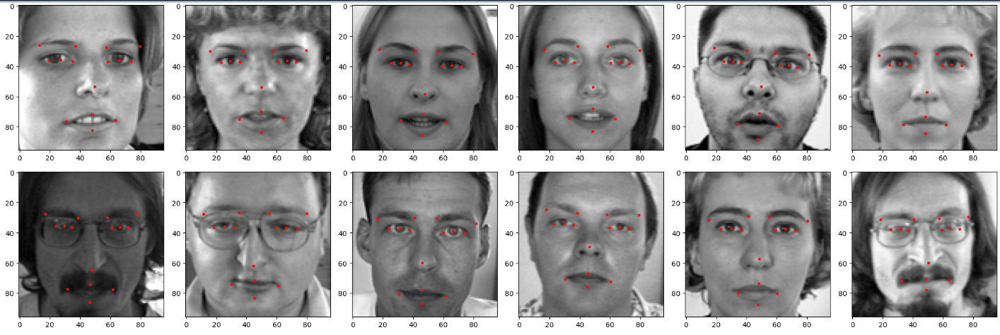
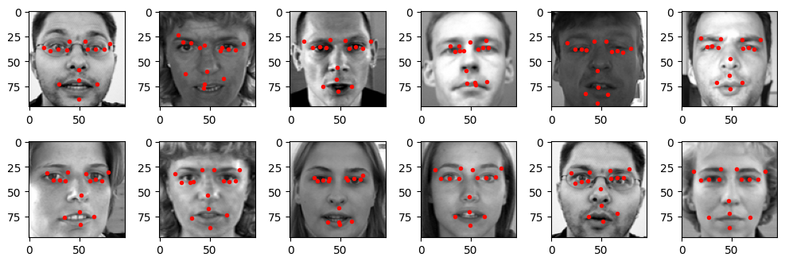
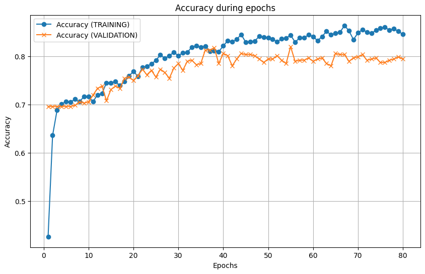
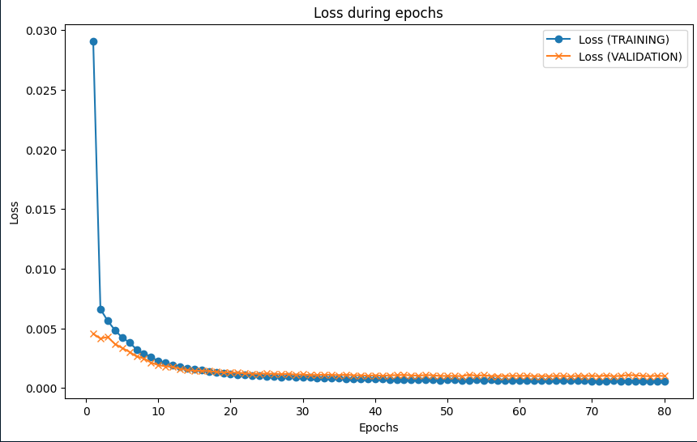

# Facial Landmark Detection with CNN using Keras

This project implements a **Facial Landmark Detector** using a **Convolutional Neural Network (CNN)** and the **Keras** library. The network is trained to detect facial keypoints such as eyes, nose, mouth, and jawline from an input image.

## 📋 Overview

The goal of this project is to detect specific facial keypoints (landmarks) on human faces, such as:

- Eyes
- Eyebrows
- Jawline
- Nose
- Mouth

The neural network is trained using a labeled facial image dataset. The architecture is built using **Keras** (with **TensorFlow** as the backend) for accurate facial landmark detection in images.

## Images

### Predictions

### Errors

### Accuracy

### Loss 
